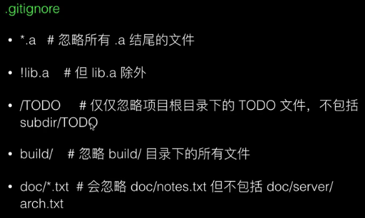

- git config <--global> user.name <name>
- git config --global core.editor vim
- git config --global --edit  //编辑
- 用户级的是.git/config配置
***
# bare仓库 中央仓库
- 创建 git init --bare testgit.git
- 连接 git remote add origin localhost:/home/matt/git/testgit.git  
	- 或者matt@localhost:/home/matt/git/testgit.git
	- git地址其实就是个ssh地址
	- ssh登录     ssh ldz@192.168.0.1
- github远程仓库不用建.redme
- 链接  ssh -T git@github.com
-	git remote add origin git@github.com:5201413/st.git //其中git@github.com:5201413/atest.git 是你github 项目的地址直接拷贝过来即可
- git push -u origin master //将本地项目更新到github项目上去
- 强制pull git pull origin master --allow-unrelated-histories
- 查看连接的远程仓库 git revoe -v 
- 
git remote set-url origin https://e.coding.net/015/fhw/fhw.git
- git init
- git add file
- git add .  //暂存所有文件
### 恢复 删除或者误修改或者误提交的恢复操作
- git rm file
- git restore --staged file //丢弃暂存  多次暂存恢复到上次提交   不影响工作区
- git restore file //丢弃工作区更改  多次修改恢复到上次暂存
### reset revert 
### 重命名
- git mv soucefile targetfile
- git mv a.md b.md
- git restore b.md
- git restore --staged b.md
- git restore --staged a.md
- git restore a.md

### amend 忽略上一次快照,就当是一次提交
git commit --amend -m "二次当一次提交"

### commit
- git commit -o file -m "" //提交一个文件
- git commit -m "提交信息"  //提交所有  

### .gitgnore
- 放依赖配置文件pom.xml,build.gradle
- 创建.gitignore,把忽略的文件加入,add,commit
```
target/          //忽略这个target目录
angular.json    //忽略这个angular.json文件
log/*           //忽略log下的所有文件
css/*.css       //忽略css目录下的.css文件
*.b				//忽略.b结尾的
!a.b			//a.b除外
/*/a.txt 		//所有一层下面的a.txt
/**/a.txt 		//所有层的a.txt
```

### 分支

```
列出分支		 git branch 
创建分支		 git branch fork
删除分支		 git branch -d fork  //分支没合并(不相同)不能合并
删除分支(强制)	git branch -D fork
重命名当前分支		 git branch -m newfork

切换到上一个分支   git checkout -
切换分支		  git checkout fork
切换分支(创建)	  git checkout -b fork
切换分支(基于...创建) git checkout -b fork basefork

合并到当前分支	git merge fork
```
### 检出checkout

- git checkout commit到某分支修改了后要保存需 checkout -b重新建立分支保存
- git add commit此修改然后 
- git branch fork 上面commitid

> HEAD指向当前分支,当前分支指向最后一次commit	

> ff合并不会添加commit号

> git merge	--no-off fork
 	


- git rm file //删除文件可恢复

### reset 到
	- 回到某个commit git reset --hard commitid  //四个或者以上既可
	- 回到上一个提交 git reset --hard HEAD^ //^^向后走二部  当前 1 2
	- 回到第几      git reset --hard HEAD ~2 //当前 1 2
	- 操作的commit日志 git reflog

### stash 
> 当前开发未提交要切换到其他分支时使用
> 
> git stash 保存状态
> 
> git list 查看状态日志
> 
> 修改保存状态git stash save -m "lkjl"
> 
> git stash pop 恢复状态		//默认回到stash@{0}
> 
> git stash apply stash@{2}  //不删除stash状态
> 
> git stash drop stash@{2}		//删除这个stash
> 
### 标签 tag
> git tag	&emsp;		//查看有多少标签
> 
> git tag tag		//无备注打标签
> 
> git tag -a tag -m "lkj"//备注到标签
> 
> git tag -d tag	//删除标签
> 
> git tag -l 'v*' //查找标签 v开头的
### diff
- blame  查看每一行谁提交和时间
- diff -u file file1
- 工作区文件:绿色增加 红色修改 一行斜线是删除一行
-  git diff			暂存与工作区比较
-  git diff HEAD 	commit与工作区比较
-  git diff -cached commit与暂存比较
### 远程仓库
- git remote add origin <server>  //origin是server的别名
- git push origin master	//推送到origin(server)的master分支

- 提交 git push -u origin master  
- 创建裸仓库 ssh user@host git init --bare /path/to/repo.git  后缀.git约定俗成				
- git clone ssh://user@host/path/to/repo.git				//自动关联了远程为origin	
- git push origin master	
- 需要将 John 的更新拉取到她的仓库，和她的本地修改整合后，然后重试。	