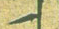

** Paste Image: Path 保存图像文件的目的地。
   ${currentFileDir}：包含当前编辑文件的目录的路径。//当前/img

base path 这个设置的是粘贴文件时复制的目标目录
** ${projectRoot} 是()里面是声明
   - project root 从打开目录开始
   - currentdirfile 从当前目录开始
   - 不填绝对目录

Paste Image: Base Path 这个设置会影响到粘贴文件时候 (/image/xxxx.png) 路径的粘贴, 不然会显示 (../images/xxxx.png)

Paste Image Prefix 这个是图片路径的前缀， 不然图片路径为 , 设置这个就是 

Pates Image: Insert Pattern 这个设置是可以填充  的 xxxx 部分，不然默认为空
b/b.md
pa00032156
## aa
- a
- b
- c
- asdf
# lkjlkjlj

123333654
2
32012345678
01234567
01
ab4531234
merge 
git branch
git merge (branch) 合并分支 branch合并到当前

01
